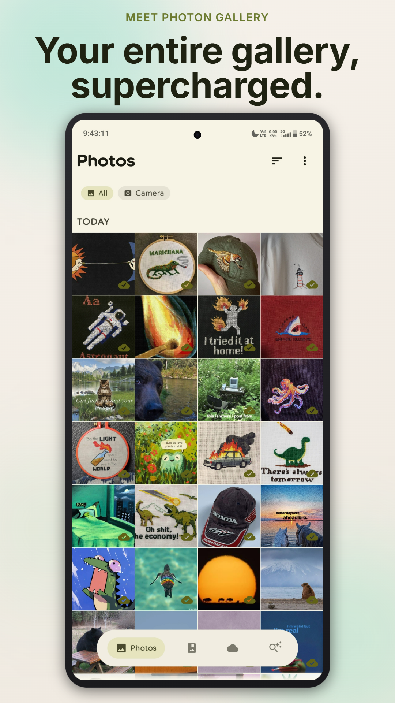
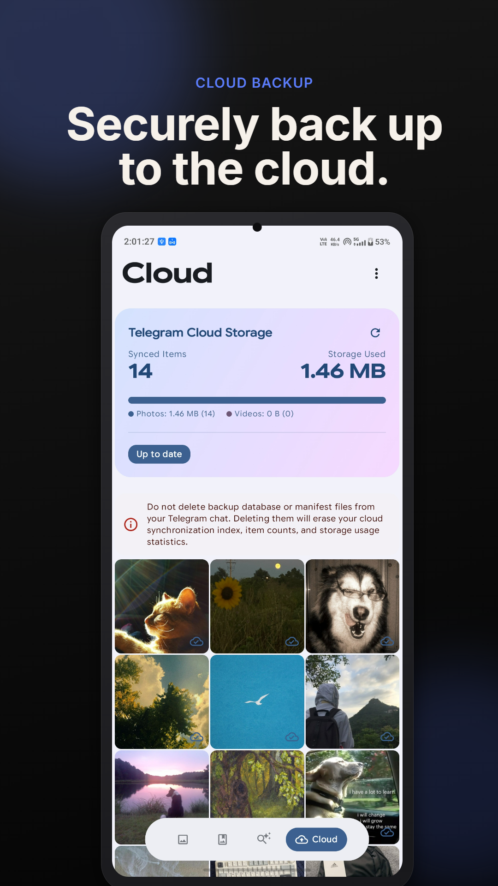
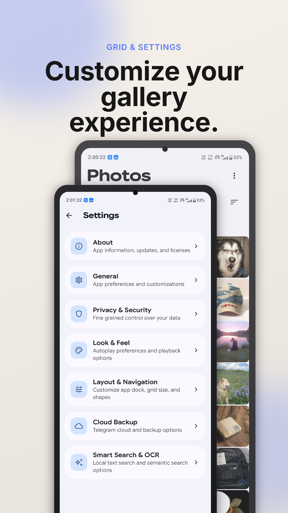
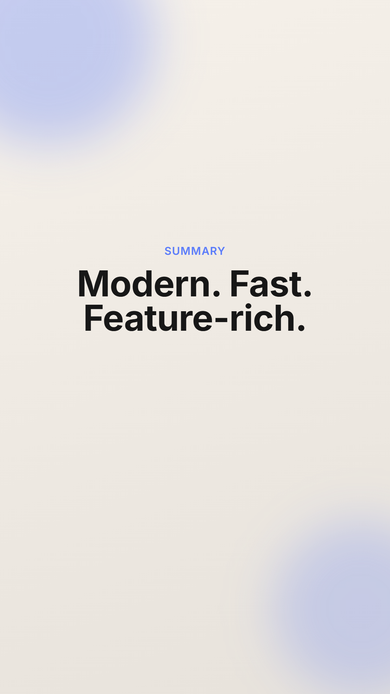

<p align="center">
  
</p>

<h1 align="center">Photon Gallery</h1>

<p align="center">
  <a href="https://github.com/Bn5prS/Photon_Gallery/stargazers"></a>
  <a href="https://github.com/Bn5prS/Photon_Gallery/releases"></a>
  <a href="https://github.com/Bn5prS/Photon_Gallery/blob/main/LICENSE"></a>
  <a href="https://github.com/Bn5prS/Photon_Gallery"></a>
  <a href="https://github.com/Bn5prS/Photon_Gallery"></a>
</p>

<p align="center">
  <strong>A high-performance Android gallery app built with 100% Jetpack Compose, Material 3 Expressive, and Coil 3.</strong><br>
  <strong>On-device AI search, biometric vault, and Telegram cloud backups — v2.0.0</strong>
</p>

<p align="center">
  <a href="https://github.com/Bn5prS/Photon_Gallery/releases/latest/download/app-release.apk"></a>
</p>

---

## Features

### 🖼️ Core Experience
- **Smooth Media Browsing**: Browse all your local photos and videos smoothly with highly responsive grids, fluid image loading, and fast interactions.
- **Material 3 Expressive Design**: Modern layout utilizing shape-morphing animations, emphasized variable font weights, and physics-based spring motions.
- **Rich Format Support**: Full support for GIFs, animated WebP, animated HEIF, and SVG files — all rendered natively via Coil 3 decoders.
- **Auto-Hiding Pill Dock**: Navigation toolbar that collapses dynamically on down-scroll and re-appears on minor up-scroll to maximize screen space.

### 🧠 On-Device AI
- **Smart On-Device Search**: Secure, offline search powered by on-device MobileCLIP semantic models for natural-language prompt-based search. All inference runs 100% on-device via ONNX Runtime — your photos never leave your phone.
- **OCR Text Search**: Automatically indexes text found in photos using ML Kit OCR, so you can search for screenshots, documents, and signs by their content.

### ☁️ Cloud & Backup
- **Telegram Cloud Backup**: Synchronize selected media folders securely to your private Telegram chat using a personal Telegram userbot via TDLib (MTProto). Includes Wi-Fi only upload constraints, low-battery pausing, and location metadata stripping for enhanced privacy.

### 🔒 Privacy & Security
- **Private Space**: A biometric-protected vault (fingerprint / face unlock) to keep sensitive photos and videos hidden from the main gallery. Secured with AndroidX Biometric.

### 🛠️ Organization & Tools
- **Photo Map**: View your geotagged photos on an interactive OpenStreetMap, clustered by location. Tap a cluster to browse photos taken in that area.
- **Duplicate Cleaner**: Finds duplicate photos using perceptual hashing and lets you review and remove them in bulk to reclaim storage.
- **Collage Builder**: Select multiple photos to instantly create custom photo collages.
- **Stitch Tool**: Combine multiple images into a single stitched panorama.
- **Local Album Management**: Create folders directly in public device storage and manage a dedicated Recycle Bin next to standard folders.
- **Pinned Albums**: Pin your most-used albums to the top for quick access. Long-press any album to pin or unpin it.
- **Exclude Folders**: Hide unwanted folders from your main gallery view while keeping them accessible via search.

---

## Screenshots

| Hero View | Main Gallery Grid | Smart Search |
| :---: | :---: | :---: |
|  |  |  |

| Cloud Sync | Advanced Settings |
| :---: | :---: |
|  |  |

---

## Getting Started

### Prerequisites
- Android SDK 37 (compileSdk 37, minSdk 31 / Android 12+)
- Java JDK 11+
- Gradle 8.x+

### Build and Deploy
1. Clone the repository:
   ```bash
   git clone https://github.com/Bn5prS/Photon_Gallery.git
   ```
2. Compile and check build:
   ```bash
   ./gradlew compileDebugKotlin
   ```
3. Assemble the signed release APK:
   ```bash
   ./gradlew assembleRelease
   ```
4. Deploy the APK to your connected phone:
   ```bash
   adb install -r app/build/outputs/apk/release/app-release.apk
   ```

---

## Privacy

Photon Gallery is designed with privacy as a core principle:

- **100% On-Device AI**: All smart search, OCR indexing, and image embeddings run entirely on your phone. No data is sent to any cloud AI service.
- **No Analytics or Telemetry**: The app contains zero tracking, crash reporting services, or usage analytics.
- **Telegram Backup is Opt-In**: Cloud backup only activates if you explicitly configure your own Telegram account. Media is sent to your private Saved Messages — not to any third-party server.
- **Location Stripping**: When uploading to Telegram, EXIF location metadata is automatically stripped to protect your location privacy.
- **Biometric Vault**: Private Space is protected by your device's biometric authentication. Vault files are stored separately and never appear in the main gallery.

---

## Contributing

Contributions are welcome! Here's how to get started:

1. **Fork** the repository
2. **Create a feature branch**: `git checkout -b feature/my-feature`
3. **Commit your changes**: `git commit -m "Add my feature"`
4. **Push to the branch**: `git push origin feature/my-feature`
5. **Open a Pull Request**

### Guidelines
- The app is 100% Jetpack Compose — no XML layouts.
- Follow the MVVM + Repository pattern: `UI (Composable) → ViewModel (StateFlow) → Repository → Room / ContentResolver / ML`
- Use `Dispatchers.IO` for all file and database operations — never block the main thread.
- All image loading must use Coil 3. No Glide, no Picasso.
- Run `./gradlew assembleRelease` and verify the build succeeds before submitting.

See [GEMINI.md](GEMINI.md) for detailed project rules and coding standards.

---

## License

This project is licensed under the **GNU General Public License v3.0** — see the [LICENSE](LICENSE) file for details.